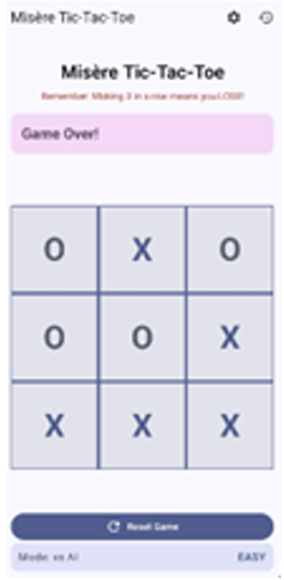
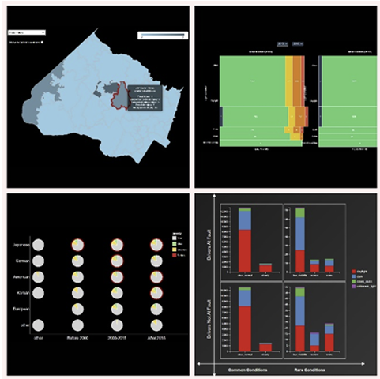

# Soumya Nagendra
**MS in Computer Science - ASU** | Cumulative GPA: 3.74 
[Email](mailto:soumyanagendra29@gmail.com)

## 🎓 Education
* **MS in Computer Science**, Arizona State University-USA (May 2026).
* **BE in Computer Science**, KLE Technological University-India (2024).

---

## 🛠 Technical Skills
*Categorized expertise based on my academic and research background.*

Programming Languages

  C++ Python GoLang 
  SQL Kotlin C#

Web & Mobile Development

  JavaScript (Advanced) React 
  HTML5/CSS3 Android Studio 
  Jetpack Compose

Cloud, DevOps & Research Tools

  AWS (Braket) Kubernetes 
  Docker IBM Qiskit 
  Ansys Workbench D3.js

---

## 🚀 Projects

  <a href="./projects/tic-tac-toe" class="project-tile">
    
    

      <h3>AI Tic-Tac-Toe</h3>
      
Android app with Minimax AI & P2P networking.

    

  </a>

  <a href="./projects/accident-analysis" class="project-tile">
    
    

      <h3>Accident Analysis</h3>
      
Full-stack geospatial platform with spatial indexing.

    

  </a>

  

  <a href="./projects/quantum-ml" class="project-tile">
    
    

      <h3>Quantum ML</h3>
      
Quantum-enhanced decision trees on AWS Braket.

    

  </a>

